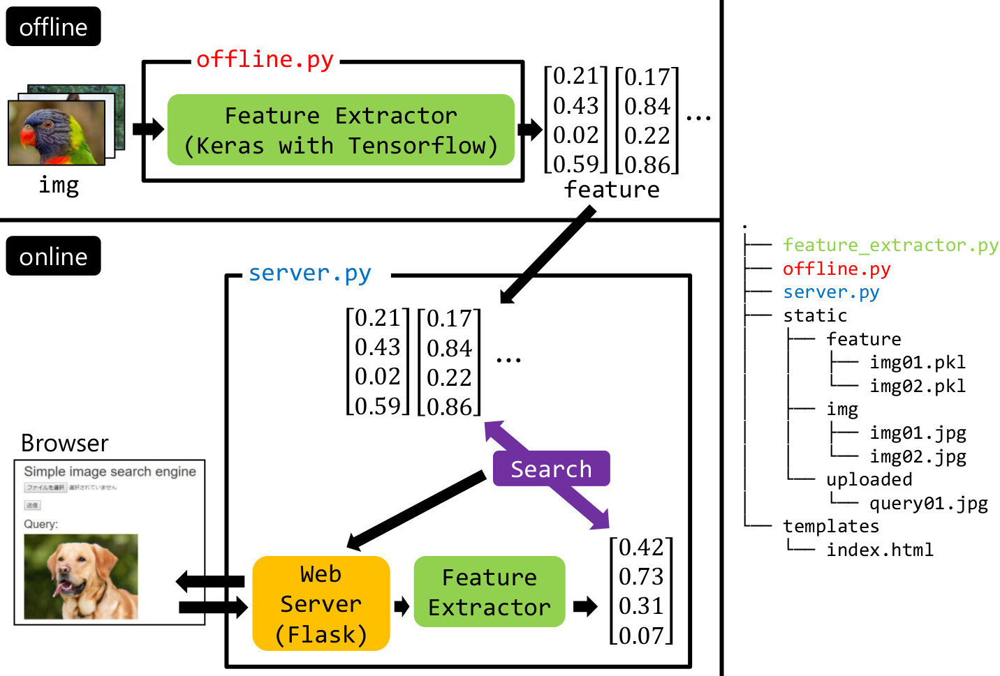
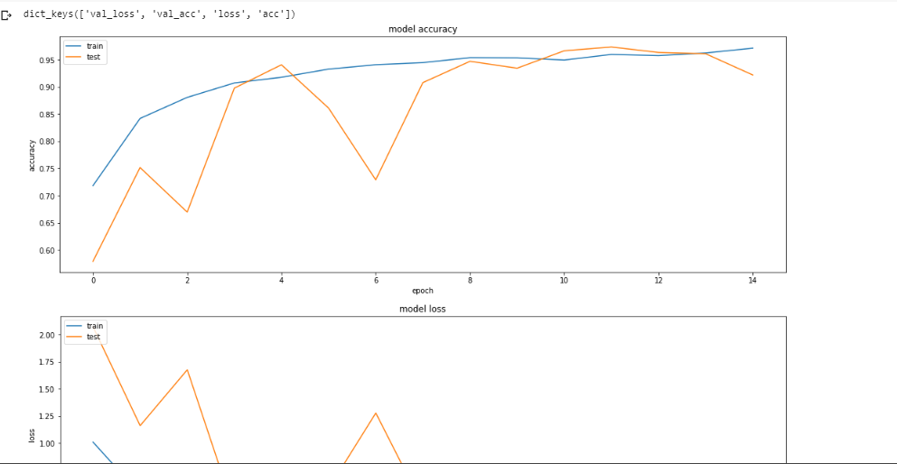

# Hachi
Dog's breed Classifier and Similar Dogs search engine. An Flask app to classify Dog's type and Find similar dogs.
Instructions
Run Classification:
## Train Model - 
1. Classification/Dogs.ipynb 
2. Then save the model- Dogs.h5
## To extract features
run feature_extractor.py
## Run Server:
python3 server.py

## Abstract
This codebase tries to present in the simplest and most compact way a one of the major Transfer Learning techniques, which have emerged over the past years. This project contains two main things :- Classification with the help of Transfer Learning and Features extraction for Image similarity. Flask is used for serving these models/ Features.

[Classification](#Classification)

[Image-similarity](#Image-similarity)

[Weights](#Weights)

# Classification

## 

# Image-similarity

# Weights
For Yolo you can download from  - https://pjreddie.com/darknet/yolo/

To get the weights file of Dogs breed classifier mail me at kashyap32raval@gmail.com (Or just train it. Colab will be very useful for this task :) )

